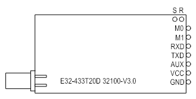
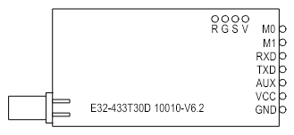
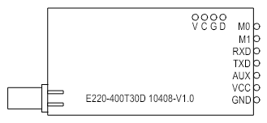
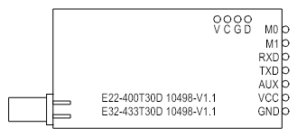
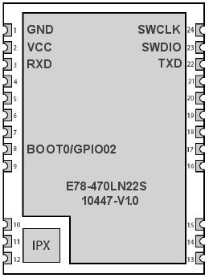
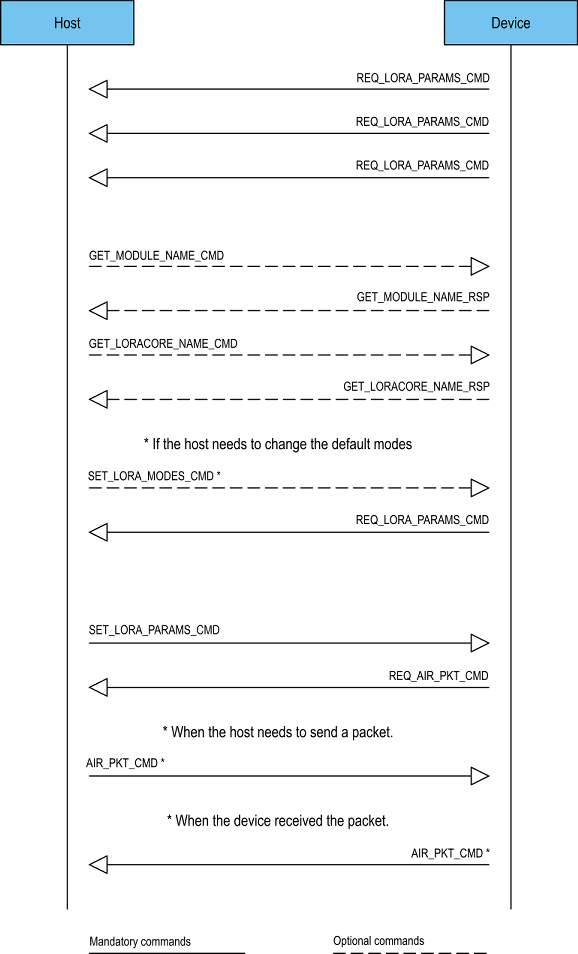

## Custom firmware for 433MHz LoRa UART modules from EByte


### Hardware

List of tested 433MHz LoRa UART modules from EByte:
| Module | PCB Version | MCU | LoRa Core | Custom Firmware | Toolchain |
| :------ | :------ | :------ | :------: | :------: | :------: |
| E32-433T20D | 32100-V3.0 | STM8L151G6 | SX1278 | &check; | IAR EW STM8 |
| E32-433T30D | 10010-V6.2 | STM8L151G6 | SX1278 | &check; | IAR EW STM8 |
| E220-400T30D | 10408-V1.0 | HC32L110C4UA | LLCC68 |  |  |
| E22-400T30D | 10498-V1.1 | MSP430FR2433 | LLCC68 |  |  |
| E32-433T30D | 10498-V1.1 | MSP430FR2433 | LLCC68 |  |  |
| E78-470LN22S | 10447-V1.0 | ASR6601CB | SX1262 |  |  |

#### E32-433T20D 32100-V3.0 (STM8L151G6 + SX1278)
Bottom View:


#### E32-433T30D 10010-V6.2 (STM8L151G6 + SX1278)
Bottom View:



Wiring (for unlocking, flashing and debugging):
* Module VCC -> VCC
* Module GND -> GND <- St-LinkV2 GND
* Module R -> St-LinkV2 RST
* Module S -> St-LinkV2 SWIM

Wiring (for operation):
* Module TXD -> Host UART RxD
* Module RXD -> Host UART TxD
* Module M0 -> LED via MOSFET (Optional)
* Module VCC -> VCC
* Module GND -> GND

#### E220-400T30D 10408-V1.0 (HC32L110C4UA + LLCC68)
Bottom View:



Wiring (for unlocking and flashing):
* Module VCC -> [use schematic and tool](https://github.com/homemcu/hc32l110-serial-boot)
* Module GND -> [use schematic and tool](https://github.com/homemcu/hc32l110-serial-boot)
* Module C -> USB2UART RX
* Module D -> USB2UART TX

Wiring (for flashing and debugging after unlocking):
* Module VCC -> VCC
* Module GND -> GND <- J-Link GND
* Module C -> J-Link SWCLK
* Module D -> J-Link SWDIO

Wiring (for operation):
* Module TXD -> Host UART RxD
* Module RXD -> Host UART TxD
* Module M0 -> LED via MOSFET (Optional)
* Module VCC -> VCC
* Module GND -> GND

#### E22-400T30D 10498-V1.1 (MSP430FR2433 + LLCC68)
#### E32-433T30D 10498-V1.1 (MSP430FR2433 + LLCC68)
Bottom View:



Wiring (for unlocking, flashing and debugging):
* Module VCC -> VCC
* Module GND -> GND <- MSP-FET430UIF GND
* Module C -> MSP-FET430UIF SBWTCK
* Module D -> MSP-FET430UIF SBWTDIO

Wiring (for operation):
* Module TXD -> Host UART RxD
* Module RXD -> Host UART TxD
* Module M0 -> LED via MOSFET (Optional)
* Module VCC -> VCC
* Module GND -> GND

#### E78-470LN22S 10447-V1.0 (ASR6601CB)
Top View:



Wiring (for unlocking):
* Module VCC -> VCC
* Module GND -> GND <- J-Link GND
* Module SWCLK (24) -> J-Link SWCLK
* Module SWDIO (23) -> J-Link SWDIO
* Module BOOT0 (8) -> VCC

Wiring (for flashing and debugging after unlocking):
* Module VCC -> VCC
* Module GND -> GND <- J-Link GND
* Module SWCLK (24) -> J-Link SWCLK
* Module SWDIO (23) -> J-Link SWDIO

Wiring (for operation):
* Module TxD (22) -> Host UART RxD
* Module RxD (3) -> Host UART TxD
* Module GPIO02 (8) -> LED via MOSFET (Optional)
* Module VCC -> VCC
* Module GND -> GND


---
### Communication Protocol
#### Byte Ordering
Multi byte fields are transferred over the UART interface in little endian format.

#### UART connection settings
The following settings are used for the UART connection:
| Parameter | Value |
| :------ | :------ |
| Baud Rate | 115200 |
| Data Bits | 8 |
| Stop Bits | 1 |
| Parity | None |
| Flow Control | No |

#### General UART packet format
| Start of Frame | Packet Info | Payload Length | Payload |
| :------: | :------: | :------: | :------: |
| 2 bytes (0x5340) | 1 byte | 2 bytes | 0 - 258 bytes |

#### Command Packet
| Command | Command direction | Packet Info Value | Payload |
| :------ | :------ | :------ | :------ |
| SET_LORA_PARAMS_CMD | Host --> Module | 0x01 | [7 bytes](#set_lora_params_cmd) |
| REQ_LORA_PARAMS_CMD | Host <-- Module | 0x02 | Not used (0 bytes) |
| REQ_AIR_PKT_CMD | Host <-- Module | 0x03 | Not used (0 bytes) |
| GET_RSSI_CMD | Host --> Module | 0x04 | Not used (0 bytes) |
| SET_RSSI_CMD | Host <-> Module | 0x05 | [2 bytes](#set_rssi_cmd) |
| GET_MODULE_NAME_CMD | Host --> Module | 0x06 | Not used (0 bytes) |
| GET_MODULE_NAME_RSP | Host <-- Module | 0x07 | [See description](#get_module_name_rsp) |
| GET_LORACORE_NAME_CMD | Host --> Module | 0x08 | Not used (0 bytes) |
| GET_LORACORE_NAME_RSP | Host <-- Module | 0x09 | [See description](#get_loracore_name_rsp) |
| SET_LORA_MODES_CMD | Host --> Module | 0x0A | [8 bytes](#set_lora_modes_cmd) |
| REQ_LORA_MODES_CMD | Host <-- Module | 0x0B | Not used (0 Bytes) |
| AIR_PKT_CMD | Host <-> Module | 0x80 | [See description](#air_pkt_cmd) |

#### SET_LORA_PARAMS_CMD
Set Frequency, Bandwidth, Spreading Factor and Coding Rate for module. 
| Field Name | Byte Index | Description |
| :------ | :------ | :------ |
| Frequency | 0 - 3 | Frequency in Hz |
| Bandwidth (BW) | 4 | see below |
| Spreading Factor (SF) | 5 | see below |
| Coding Rate (CR) | 6 | see below |

Bandwidth (BW)
| Value | Description |
| :------ | :------ |
| 0x00 | 7.8 kHz |
| 0x01 | 10.4 kHz |
| 0x02 | 15.6 kHz |
| 0x03 | 20.8 kHz |
| 0x04 | 31.2 kHz |
| 0x05 | 41.7 kHz |
| 0x06 | 62.5 kHz |
| 0x07 | 125 kHz |
| 0x08 | 250 kHz |
| 0x09 | 500 kHz |

Spreading Factor (SF)
| Value | Description |
| :------ | :------ |
| 0x05 | SF5 |
| 0x06 | SF6 |
| 0x07 | SF7 |
| 0x08 | SF8 |
| 0x09 | SF9 |
| 0x0A | SF10 |
| 0x0B | SF11 |
| 0x0C | SF12 |

Coding Rate (CR)
| Value | Description |
| :------ | :------ |
| 0x01 | 4/5 |
| 0x02 | 4/6 |
| 0x03 | 4/7 |
| 0x04 | 4/8 |

#### REQ_LORA_PARAMS_CMD
Request from the module for the SET_LORA_PARAMS_CMD command before any radio operation.

#### REQ_AIR_PKT_CMD
The radio has been initialized. The module's radio is in the state of receiving a radio packet, the module is also ready to transmit a packet from the host.

#### GET_RSSI_CMD
Command from the host to obtain the current RSSI value. Valid only when the radio is initialized.

#### SET_RSSI_CMD
The command can be transmitted both from the host to the module and back. If transmitted by the host, it sets the RSSI threshold value above which the module's radio will not attempt to transmit. If sent by the module, it returns the current RSSI value that its radio measured at the time of the request.
| Field Name | Byte Index | Description |
| :------ | :------ | :------ |
| RSSI | 0 - 1 | RSSI value |

#### GET_MODULE_NAME_CMD
This command is used to get the module name.

#### GET_MODULE_NAME_RSP
This command response is used to send the module name, for example `e32-433t30d-10010-v6.2`.
| Field Name | Byte Index | Description |
| :------ | :------ | :------ |
| Name | 0 - n | Module name |

#### GET_LORACORE_NAME_CMD
This command is used to get the LoRa chip name.

#### GET_LORACORE_NAME_RSP
This command response is used to send the LoRa chip name, for example `SX1278`.
| Field Name | Byte Index | Description |
| :------ | :------ | :------ |
| Name | 0 - n | LoRa chip name |

#### SET_LORA_MODES_CMD
Set Packet Format, CRC, Preamble Length etc. for module.
| Field Name | Byte Index | Description |
| :------ | :------ | :------ |
| Packet Format | 0 | see below |
| Packet Length | 1 | Packet length if Implicit mode is selected |
| DIO Mapping | 2 | not used, always 1 |
| CrcOnPayload | 3 | see below |
| InvertIQ | 4 | see below |
| PreambleLength | 5 - 6 | 6 - 65535 |
| SyncWord | 7 | see below |

Packet Format
| Value | Description |
| :------ | :------ |
| 0x00 | Explicit mode (Variable length packet format) |
| 0x01 | Implicit mode (Fixed length packet format) |

CrcOnPayload
| Value | Description |
| :------ | :------ |
| 0x00 | CRC disable |
| 0x01 | CRC enable |

InvertIQ
| Value | Description |
| :------ | :------ |
| 0x00 | Normal mode |
| 0x01 | I and Q signals are inverted |

SyncWord
| Value | Description |
| :------ | :------ |
| 0x12 | Private |
| 0x34 | Public |

#### REQ_LORA_MODES_CMD
Request from the module for the SET_LORA_MODES_CMD command before any radio operation.

#### AIR_PKT_CMD
The command can be transmitted both from the host to the module and vice versa. If it is transmitted by the host, it contains only data for radio transmission. If it is sent by the module, in addition to the data it contains the current RSSI and SNR values measured by the module's radio during reception.
| Field Name | Byte Index | Description if the module sends | Description if the host sends |
| :------ | :------ | :------ | :------ |
| Data | 0 - n (max 255) | Data as received over the air | Data to transmit over the air |
| RSSI | n+1 - n+2 | RSSI value | not used |
| SNR | n+3 | SNR value | not used |

---
### Messaging


---
### Messaging example

```console
> receiver.py -sCOM27
INFO:root:Sent: 40 53 0A 08 00 01 30 01 01 00 08 00 55
INFO:root:Received: 40 53 02 00 00
INFO:root:Sent: 40 53 01 07 00 80 50 DE 19 07 09 04
INFO:root:Received: 40 53 03 00 00
INFO:root:Wait for air packet reception...
INFO:root:Received: 40 53 80 33 00 00 01 02 03 04 05 06 07 08 09 0A 0B 0C 0D 0E 0F 55 55 55 55 55 55 55 55 55 55 55 55 55 55 55 55 AA AA AA AA AA AA AA AA AA AA AA AA AA AA AA AA D6 FF 0B
```
```console
> transmitter.py -sCOM24
INFO:root:Sent: 40 53 0A 08 00 01 30 01 01 00 08 00 55
INFO:root:Received: 40 53 02 00 00
INFO:root:Sent: 40 53 01 07 00 80 50 DE 19 07 09 04
INFO:root:Received: 40 53 03 00 00
INFO:root:Sent: 40 53 80 33 00 00 01 02 03 04 05 06 07 08 09 0A 0B 0C 0D 0E 0F 55 55 55 55 55 55 55 55 55 55 55 55 55 55 55 55 AA AA AA AA AA AA AA AA AA AA AA AA AA AA AA AA 00 00 00
```
